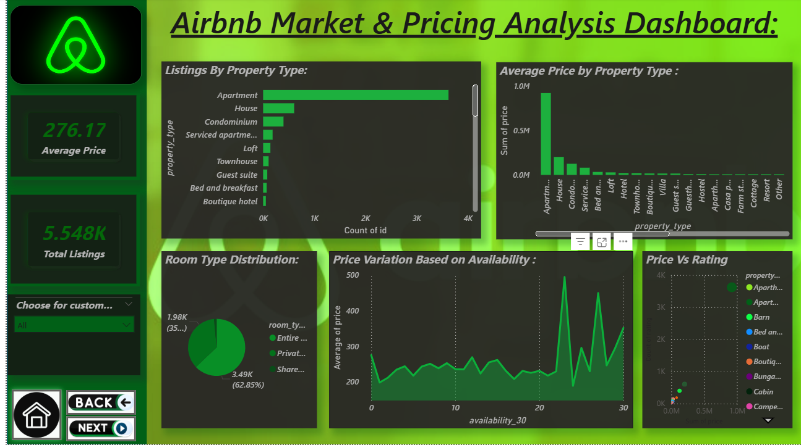

# Airbnb Data Analysis Project | Power BI & Excel

## Project Overview
This project focuses on analysing Airbnb datasets to identify pricing trends, occupancy rates, and customer behaviour patterns using Power BI and Excel.

## Tools & Technologies
- Power BI
- Microsoft Excel
- Power Query
- DAX
- Data Cleaning
- Data Visualization

## Key Responsibilities
- Analysed Airbnb datasets to identify pricing trends, occupancy rates, and customer behaviour patterns.
- Performed data cleaning, transformation, and validation using Power Query and Advanced Excel.
- Developed interactive Power BI dashboards with KPIs, DAX measures, and automated reporting for business insights.

## Dashboard Preview

## Key Insights
- Identified pricing patterns across different property types.
- Analysed occupancy trends and customer preferences.
- Created KPI-based dashboards for business reporting and decision-making.

## Author
Shreenidhi B D
